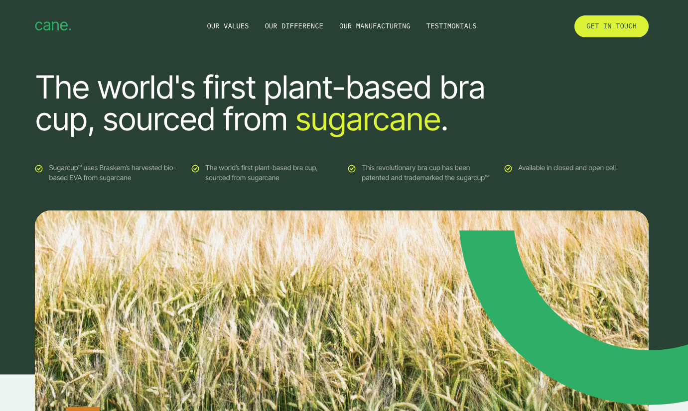
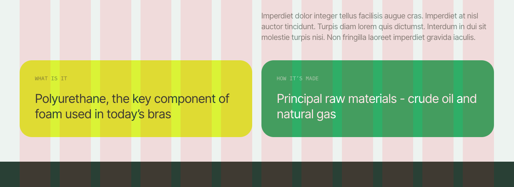

# pact. Skills Assessment

Simple demo site.

## To run locally

In the project directory:

### `npm install`

To install all required node modules.

### `npm run dev`

Runs the app in the development mode. Will provide you with a `localhost` url in the terminal.

**Note:** this was built using Node v16. If anything goes wrong with the build, check that you're using the correct version first.

## Stack

- vanilla JS/Typescript
- SASS
- Vite
- that's it!

## Features and notes

- I added a footer. Felt like it could use one.
- The stickiness of the nav does not use a scroll listener, but rather a more-performant `IntersectionObserver`
- I wasn't sure if those cards at the bottom should've been links or not.
- I have a grid-overlay in there to make sure everything's lining up correcly. You can view it by either:
  - a) inspect the DOM for an element with a CSS class of `grid-guide`. Disable the `display: none;`. or...
  - b) create a new bookmark called 'Toggle grid' and set the url as `javascript:(function() { var gridGuide = document.querySelector('.grid-guide'); if(gridGuide) { var gridStyle = getComputedStyle(gridGuide); if(gridStyle.display === 'none') { gridGuide.style.display = 'block'; } else { gridGuide.style.display = 'none'; } } })();`
    
- The email form at the bottom "works" in that it shows an error and success, but doesn't actually submit anywhere.
- I personally find some of the anims a little overkill, but I added them just to show that I could. 😀
- The large sugarcane image has been exported at various breakpoint sizes and at 1x, 2x for retina support.
- The nav is a11y friendly. It has the appropriate aria-labels, it traps keyboard focus when it's open, the Esc key closes it, etc...
- I added a favicon.

## Nice to haves if I had more time

- Would like to add an a11y-friendly "skip to nav" and/or "skip to content" button
- There's something odd going on in that the nav sometimes gets set to its "sticky" state immediately on page-load. It also sometimes animates on by moving down a few pixels. I believe that has something to do with how Vite injects the CSS at runtime. Not 100% though as this is the first time I've tested out Vite.
- I wanted to add a parallax scroll anim to the sugarcane image and the "bra cups?" (the orange and green semi-circles). Needed to stop though otherwise I would just keep adding more bells and whistles forever.
